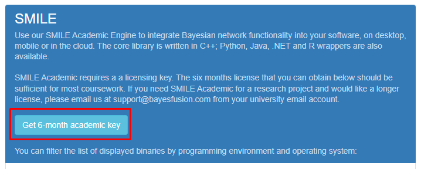
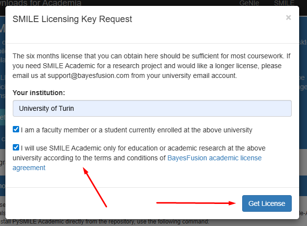

# Attack Graph driven Discrete Event Simulation for Security Assessment in Power Systems — Artifacts - ACM SIGSIM PADS 2026

Repository for running Control Finite State Machine-based simulations in OMNeT++ and learning Dynamic Bayesian Network (DBN) parameters from generated data traces.

The results reproduced by this repository are reported in the paper:
"Attack Graph driven Discrete Event Simulation for Security Assessment in Power Systems"

Accepted at ACM SIGSIM PADS 2026, June 24-26, 2026, Vienna, Austria.

## Authors and Contacts
- Davide Savarro (corresponding author) &rarr; [davide.savarro@unito.it](mailto:davide.savarro@unito.it)
- Davide Cerotti &rarr; [davide.cerotti@uniupo.it](mailto:davide.cerotti@uniupo.it)
- Daniele Codetta Raiteri &rarr; [daniele.codetta@uniupo.it](mailto:daniele.codetta@uniupo.it)
- Lavinia Egidi &rarr; [lavinia.egidi@uniupo.it](mailto:lavinia.egidi@uniupo.it)
- Giuliana Franceschinis &rarr; [giuliana.franceschinis@uniupo.it](mailto:giuliana.franceschinis@uniupo.it)
- Luigi Portinale &rarr; [luigi.portinale@uniupo.it](mailto:luigi.portinale@uniupo.it)
- Giovanna Dondossola &rarr; [giovanna.dondossola@rse-web.it](mailto:giovanna.dondossola@rse-web.it)
- Roberta Terruggia &rarr; [roberta.terruggia@rse-web.it](mailto:roberta.terruggia@rse-web.it)

## How to cite us

If you use this work in your research, please cite the following paper:

```
@inproceedings{10.1145/3806789.3810256,
	author = {Savarro, Davide and Cerotti, Davide and Codetta Raiteri, Daniele and Egidi, Lavinia and Franceschinis, Giuliana and Portinale, Luigi and Dondossola, Giovanna and Terruggia, Roberta},
	title = {Attack Graph driven Discrete Event Simulation for Security Assessment in Power Systems},
	year = {2026},
	isbn = {9798400726484},
	publisher = {Association for Computing Machinery},
	address = {New York, NY, USA},
	url = {https://doi.org/10.1145/3806789.3810256},
	doi = {10.1145/3806789.3810256},
	abstract = {As power grids transition into decentralized Cyber-Physical Power Systems, the digitalization of legacy devices has dramatically multiplied the potential entry points for cyber adversaries. To accurately assess these threats, security models must capture both detailed attack steps and network timing effects. However, obtaining real-world cyber incident data to parameterize these models is rarely possible due to strict privacy and confidentiality constraints within utility companies. To overcome this limitation, we present a simulation-based framework that integrates Attack Graphs (AGs) with the OMNeT++ Discrete Event Simulation environment and Dynamic Bayesian Networks (DBNs). Attack step logic is modeled through Control Finite State Machines, allowing for dynamic interactions between attacker behavior and simulated network components. The simulation automatically generates time-series data used to train AG-derived DBNs used to answer probabilistic queries on attack progression. We present a case study on a Distributed Energy Resource cyberattack which demonstrates that the framework captures complex temporal dependencies and maintains high predictive accuracy supporting cybersecurity assessment for critical energy infrastructures. The code and models implemented in this work are available here: https://github.com/Dosclic98/dbn-sim-learning.git.},
	booktitle = {Proceedings of the 40th ACM SIGSIM International Conference on Principles of Advanced Discrete Simulation},
	pages = {139–151},
	numpages = {13},
	keywords = {Cyber-Physical Power Systems; Distributed Energy Resources; Cybersecurity simulation; Attack Graphs; Dynamic Bayesian Networks; Discrete Event Simulation; Probabilistic risk assessment;},
	location = {Vienna, Austria},
	series = {SIGSIM-PADS '26}
}
```

## Replicating the results (recommended: Docker)

Using the provided Dockerfile, you can build a container that includes all necessary dependencies to run the full pipeline (simulation, parameterization, validation, and analysis). Setting up the simulation environment manually can impact the automatic replicability of the results due to possible configuration differences, so using Docker is the recommended approach.

### Requirements
- x86_64 CPU architecture
- 32 GB of RAM
- At least 20 GB of free disk space for the container, simulation outputs, and results
- Linux system with Docker, `sudo`, `bash` and `git` installed (see the specific versions we used below)

> [!NOTE]
> In this README we assume that you need to acquire superuser privileges (using `sudo`) to run Docker commands; if your setup uses the `docker` group/rootless Docker, manually remove `sudo` from the commands

### Reference host specifications (used to obtain the reported results)

Hardware Specifications:
- **OS**: Ubuntu 22.04.5 LTS (Jammy)
- **Kernel**: 5.15.0-164-generic
- **CPU**: Intel(R) Xeon(R) Gold 6418H (32 logical cores @2.10GHz)
- **RAM**: 64 GB (swap: 8 GB)

Software Specifications:
- **Sudo**: 1.9.9
- **GNU Bash**: 5.1.16
- **Git**: 2.34.1
- **Docker Client & Server Engine**: 28.2.2
- **Docker buildx**: 0.21.3

### 1) Clone the repository locally

```bash
git clone --recurse-submodules https://github.com/Dosclic98/dbn-sim-learning.git
cd dbn-sim-learning
```

> [!NOTE]
> All scripts were tested by running them from the following path: `dbn-sim-learning/`.
> If you downloaded the repository as a ZIP or tar.gz file, make sure to extract it with the full folder structure intact.

This repository includes a git submodule under `MQTT_MMS_Medium/`, which contains the OMNeT++ simulation model executed by the experiments.

If you did not clone with submodules, initialize them with:

```bash
git submodule update --init --recursive
```

### 2) Add your `pysmile_license.py`

You need a BayesFusion SMILE/pysmile Academic license.

1. Navigate to the [BayesFusion support page](https://download.bayesfusion.com/files.html?category=Academia)  and log in or create an account using your academic email.
2. Request an Academic license by clicking on the following button in the SMILE section:

   

3. Fill in the form specifying your academic institution and ticking the necessary checkboxes, then click the "Get License" button.

   

4. Unzip the archive that will be immediately downloaded and locate the `pysmile_license.py` file inside it and insert the `pysmile_license.py` file in the repository root.

```
dbn-sim-learning/
├── docker/
├── models/
├── plots/
├── results/
├── traces/
├── MQTT_MMS_Medium/
├── LICENSE
├── README.md
├── pysmile_license.py  <-- insert your pysmile_license.py here
├── ...
```

### 3) Build the container

Using the helper script:

```bash
./buildContainer.sh
```

Or manually:

```bash
sudo docker buildx build --progress=plain -t omnet ./docker/
```

> [!WARNING]  
> A stable internet connection is required during the build process to download the OMNeT++ source and all other dependencies. The build process may take around 5-10 minutes depending on your connection speed and host performance.
>
> If you are behind a firewall/proxy, ensure outbound HTTPS access to at least these endpoints:
> - `github.com` (repository clone, submodules, release metadata)
> - `objects.githubusercontent.com` (release assets)
> - `pypi.org` (main index for python packages)
> - `support.bayesfusion.com` (pysmile package index)

### 4) Run the container (with shared output folders)

Using the helper script:

```bash
./runContainer.sh
```

Or manually (shares `plots/`, `results/`, `traces/` folders on the host):

```bash
mkdir -p dbn-sim-learning-container/{plots,results,traces}

sudo docker run --rm -it \
	-v "$PWD/pysmile_license.py":/home/simulation/dbn-sim-learning/pysmile_license.py:ro \
	-v "$PWD/dbn-sim-learning-container/plots":/home/simulation/dbn-sim-learning/plots \
	-v "$PWD/dbn-sim-learning-container/results":/home/simulation/dbn-sim-learning/results \
	-v "$PWD/dbn-sim-learning-container/traces":/home/simulation/dbn-sim-learning/traces \
	omnet
```

### 5) Replicate the full pipeline inside the container

From `/home/simulation/dbn-sim-learning` (container workdir), run:

```bash
./replicateResults.sh
```

This script, by calling `replicate_results.py`, will:
- run the simulation batch and trace aggregation (via `runSimulation.py`) with 1000 runs and using all but 2 of the available cores for parallelization
- run `parameterizer.py` in normal and benchmark mode
- run `data_evaluator.py`
- run `experiment_analyzer.py` in normal and benchmark mode
- run `validator_playground.py`
- print the total wall-clock time at the end

### Expected run time
The full pipeline (simulation, parameterization, validation, and analysis) takes approximately **2 hours and 15 minutes** on the reference host, with 1000 traces and using 30 cores for parallelization. The exact time may vary based on the host specifications. The most time-consuming step is the validation since the DBN must be retrained and tested multiple times for every fold and for every evidence frequency.

### 6) Check the generated outputs

The following table maps the paper elements (figures, tables and sections) to the files generated on the host under `dbn-sim-learning-container/`.

| Paper element | Generated file(s) under `dbn-sim-learning-container/` | Notes |
|---|---|---|
| Figure 5 | `plots/completion_slice_distribution.pdf` | Produced by `data_evaluator.py`. |
| Figure 6 | `plots/No evidence_targetNodes_Completed.pdf` | Produced by `experiment_analyzer.py`. |
| Figure 7 | `plots/validation_metrics_vs_evEveryNSlices.pdf` | Produced by `validator_playground.py`. |
| Table 2 | `results/simulation_resources_summary.csv`<br>`results/parameter_learning_benchmark_aggregated.csv`<br>`results/benchmark_inference_times.csv` | Aggregated simulation, parameter-learning, and inference benchmark summaries. |
| Entropy analysis (Section 5.2) | `results/node_entropy_values.csv`<br>`results/node_entropy_summary.csv` | Produced by `data_evaluator.py`; both per-node and average + std entropy values are reported. |

The originally submitted plots and results are in the same paths mentioned in the table but in the root of the repository (e.g., `plots/completion_slice_distribution.pdf`). 

> [!WARNING]  
> Time and resource usage may vary based on the host specifications and current load. The values provided in Table 2 are based on the reference host described above, but actual results may differ on different hardware or under different conditions.

## Additional information on the scripts (not strictly needed for replication)

This repository is currently organized around a small set of Python entrypoints in the repository root.
When running via Docker, outputs inside the container are written to `plots/`, `results/`, and `traces/` and are bind-mounted to the host under `dbn-sim-learning-container/{plots,results,traces}` (see the `docker/` folder and `runContainer.sh`).

### Full pipeline orchestrator

Run:

```bash
python3 replicate_results.py -r 1000 -p "$(nproc)"
```

`replicate_results.py` runs the whole pipeline in sequence:

1. `runSimulation.py` (simulation batch + resource monitoring)
2. `parameterizer.py` (single learning run)
3. `parameterizer.py --bench` (parameter-learning benchmark)
4. `data_evaluator.py` (trace distribution + entropy)
5. `experiment_analyzer.py` (inference plots)
6. `experiment_analyzer.py --bench` (inference benchmark)
7. `validator_playground.py` (k-fold validation vs evidence frequency)

It also ensures `plots/`, `results/`, and `traces/` exist before starting.

### Simulation + trace aggregation (`runSimulation.py`)

Run:

```bash
python3 runSimulation.py -r 1000 -p 30
```

It is designed to run inside the container where OMNeT++ is installed.
It launches multiple OMNeT++ runs in parallel and monitors per-run wall-clock time and peak RSS (requires `psutil`).
After all runs complete, it calls the simulator's `aggregator.sh` to produce the aggregated trace CSV.

Main outputs:
- `results/logger.log`: simulator + aggregation logs
- `results/simulation_resources.csv`: per-run wall-clock and peak RSS
- `results/simulation_resources_summary.csv`: mean/std of wall-clock and peak RSS
- `results/dbnLogs.csv` and `traces/dbnLogs.csv`: aggregated traces used by the learning/analysis scripts

### Parameter learning (`parameterizer.py`)

Defaults (edit at the top of the script if you need to change them):
- Input model: `models/DBNfromAG.xdsl`
- Output model: `models/DBNfromAG_learned.xdsl`
- Traces: `traces/dbnLogs.csv`
- Slices: `numSlices = 100`

Run a single learning pass:

```bash
python3 parameterizer.py
```

Run the benchmark (repeats learning multiple times and records time/RAM via `tracemalloc`):

```bash
python3 parameterizer.py --bench
```

Benchmark outputs:
- `results/parameter_learning_benchmark.csv`
- `results/parameter_learning_benchmark_aggregated.csv`

### Inference experiments + benchmark (`experiment_analyzer.py`)

This script loads `models/DBNfromAG_learned.xdsl` and runs the experiments defined in-code (currently an example with the single experiment named `No evidence`).
By default it uses EPIS sampling (`algoTypeExact = False`); set `algoTypeExact = True` for the exact Lauritzen algorithm.

Run inference + generate the posterior plot:

```bash
python3 experiment_analyzer.py
```

Output:
- `plots/No evidence_targetNodes_Completed.pdf`

Run the inference benchmark (repeat runs + aggregate avg/std time and peak RAM):

```bash
python3 experiment_analyzer.py --bench
```

Benchmark output:
- `results/benchmark_inference_times.csv`

### Validation vs evidence frequency (`validator_playground.py`, `validator.py`)

`validator.py` contains the `Validator` class implementing 5-fold CV over the trace dataset.
`validator_playground.py` wires it together for the experiment used in this project:
- uses `models/DBNfromAG_learned.xdsl`
- performs 5-folds CV on `traces/dbnLogs.csv` varying the  evidence frequency via `ext_ev_every_n_slices = [1, 2, 5, 10]`

Run validation (computes and stores CSVs):

```bash
python3 validator_playground.py
```

Load already-computed CSVs and only re-generate the plot:

```bash
python3 validator_playground.py --stored
```

Outputs:
- `results/5_folds-evEveryNSlices_*.csv`
- `results/5_folds-full_results.csv`
- `plots/validation_metrics_vs_evEveryNSlices.pdf`

### Trace distribution analysis (`data_evaluator.py`)

This script analyzes `traces/dbnLogs.csv` to:
- plot completion-slice histograms for selected target nodes
- compute per-node entropy of completion-slice distributions and export them to CSV

Run:

```bash
python3 data_evaluator.py
```

Outputs:
- `plots/completion_slice_distribution.pdf`
- `results/node_entropy_values.csv`
- `results/node_entropy_summary.csv`

## License
This repository is licensed under the GNU General Public License v3.0 (GPL-3.0). See the [LICENSE](LICENSE) file for details.

## Artifact Identifier
DOI: [10.5281/zenodo.19248716](https://doi.org/10.5281/zenodo.19248716)